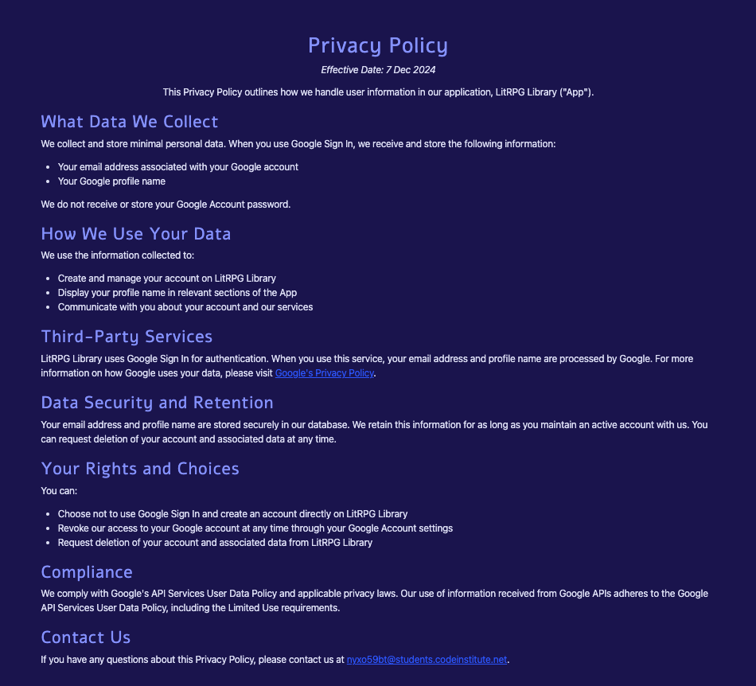

# LitRPG Library
=======
<p align="center">
  
</p>

## Introduction

LitRPG Library is a review websites specifically for books in the LitRPG and LitRPG adjacent genre. It has been developed ad part of the Code Insititutes 16 Week Fult-Stack Developer Bootcamp as my final project - demonstrating all I have learned so far. Essential criteria include use of Django, database manipulation and CRUD functionality. It is for educational purposes only (for right now).

View live site here : [LitRPG Library](https://litrpg-library-2e24401b712e.herokuapp.com/)  
  
For Admin access with relevant sign-in information: [LitRPG Admin](lhttps://litrpg-library-2e24401b712e.herokuapp.com/admin/)

<hr>

## Table of Contents

- [LitRPG Library](#flitrpglibrary)
  - [Introduction](#introduction)
  - [Table of Contents](#table-of-contents)
  - [Overview](#overview)
- [UX - User Experience](#ux---user-experience)
  - [Design Inspiration](#design-inspiration)
    - [Colour Scheme](#colour-scheme)
    - [Font](#font)
- [Project Planning](#project-planning)
  - [Strategy Plane](#strategy-plane)
    - [Site Goals](#site-goals)
  - [Agile Methodologies - Project Management](#agile-methodologies---project-management)
    - [MoSCoW Prioritization](#moscow-prioritization)
  - [User Stories](#user-stories)
    - [Visitor User Stories](#visitor-user-stories)
    - [User Registration](#user-registration)
    - [Book Reviews](#book-reviews)
    - [Comments](#comments)
    - [To Be Read List](#to-be-read-list)
    - [User Profile](#user-profile)
  - [Scope Plane](#scope-plane)
  - [Structural Plane](#structural-plane)
  - [Skeleton \& Surface Planes](#skeleton--surface-planes)
    - [Wireframes](#wireframes)
    - [Database Schema - Entity Relationship Diagram](#database-schema---entity-relationship-diagram)
    - [Security](#security)
- [Features](#features)
  - [User View - Registered/Unregistered](#user-view---registeredunregistered)
  - [CRUD Functionality](#crud-functionality)
  - [Feature Showcase](#feature-showcase)
  - [Future Features](#future-features)
- [Technologies \& Languages Used](#technologies--languages-used)
  - [Libraries \& Frameworks](#libraries--frameworks)
  - [Tools \& Programs](#tools--programs)
- [Testing](#testing)
- [Deployment](#deployment)
  - [Connecting to GitHub](#connecting-to-github)
  - [Django Project Setup](#django-project-setup)
  - [Cloudinary API](#cloudinary-api)
  - [Elephant SQL](#elephant-sql)
  - [Heroku deployment](#heroku-deployment)
  - [Clone project](#clone-project)
  - [Fork Project](#fork-project)
- [Credits](#credits)
  - [Code](#code)
  - [Media](#media)
    - [Additional reading/tutorials/books/blogs](#additional-readingtutorialsbooksblogs)
  - [Acknowledgements](#acknowledgements)

## Overview

LitRPG Library is a book review and ‘to be read’ book tracking app for all readers of the LitRPG and adjacent genres. Users are invited to:

- Join the LitRPG community
- Add a book they want to review
- Write and comment on book reviews
- Add books reviewed on the site to a ‘To Be Read’ list

LitRPG is accessible via all browsers with full responsiveness on different screen sizes. Its aim is to simplify the process of selecting books, foster a vibrant community centred around LitRPG and related genres and create a 'To Be Read' (TBR) wishlist. I have created this site to meet the needs of LitRPG readers. While, there are other book review and tracking sites out there most do no handle the different nuances of the LitRPG genre well. LitRPG aims to offer a more tailored experience for those who love Progression Fantasy, GameLit, Wuxia and LitRPG. In future developments of this this project, I hope to offer users an upgraded tracking system (select which books in a series to add to TBR or read list as the number of books in a LitRPG series can be quite large). A full list of all books added to the library and the ability to search the reviews and books. I'd also like to add the ability to move books to a read list from the tbr list and add categories and tags to help organise the books.


# UX - User Experience

## Design Inspiration

The design of my LitRPG review website evolved gradually as I navigated the learning curve of Django. Initially, I found myself overwhelmed by the framework's complexities, which left little room for creative expression. However, as I began to piece together the foundational elements of the site, I discovered more about my vision for the project and how it aligned with my growing capabilities.
Throughout this process, I drew inspiration from various sources, particularly book tracking websites like [hardcover.app](https://hardcover.app/). Their clean and intuitive interfaces highlighted the importance of user experience, motivating me to create a space where readers could easily navigate through reviews and track their reading progress.

### Colour Scheme

At mentioned above the design aspect was more of a struggle than usual. I had no clear idea of what I wanted but did have a vague notion that the colour scheme should be on the darker side based on the covers of most LitRPG. Dark but vibrant. I eventually found some options in the [Figma | UI UX Community](https://www.facebook.com/groups/207220915184146) facebook group and narrowed it down to too options. When consulted, one colleague mentioned option one reminded them of Gryffindor, so option two it was. 


  
*Dark blues and purple used for backgrounds, lighter purple for accents, off-white colour for text and the pinkish colour for highlights.


*The colour palatte was test in [Adobe Colour](https://color.adobe.com/create/color-wheel) for both colour blindness and contrast. It passed both tests.


### Font

Using [Google Fonts](https://fonts.google.com/), I imported 'Alef', 'Raleway' and 'Cabin' to my CSS file. Alef I picked out when creating my logo and decided to carry over to headings in my website It's a clear sans-serif with a bit of character. Raleway is one of my go tos for clear and readable. I did still make use of letter spacing several times. I'm a big reader and clarity is important to me, so I can read faster! I imported Cabin as a second, no-fills option for headers but ended up not using it. 
  
# Project Planning  
 
## Strategy Plane

My goal was to build the beginnings of a book review and tracking app, with an intial focus on the review side. Users can add books to the site (this would hopefully be sourced by an API in future releases) and write reviews. I currently have it set up for one review per book with other users being able to add their own thoughts on a particular book through the comments. The beginnings of the tracking side of the site can be seen in the To Be Read List, to which users can add books they are interested in reading.


### Site Goals

- Create a welcoming environment for readers to share their thoughts on LitRPG books (and adjacent genres)
- Dark colour palatte inspired by book covers
- Coomon icons with some redesigns to fit the theme
- CRUD functionalities
- Responsive UX 
- Scalable idea, for addition of future features 

## Agile Methodologies - Project Management

LitRPG is my first proper project following Agile planning methods. As someone who finds the planning side of things tricky at the very beginning (it gets easier further in!), it was a useful experience to have. I used my [Github Projects Board](https://github.com/users/laurachri-hall/projects/6/views/1) to plan and document all of my work. It worked quite well, though I found the tasks section of the user stories difficult to fill in beforehand - not really understand what each user story might need to complete it. Consequently, these were often added after the fact as I reflected on what I had actually done to accomplish the feature. It definitely did help keep me within Scope.

### MoSCoW Prioritization

I chose to follow the MoSCoW Prioritization method for LitRPG Library, identifying and labelling my:

- **Must Haves**: the 'required', critical components of the project. 
- **Should Haves**: the components that are valuable to the project but not absolutely 'vital' at the MVP stage. The 'Must Haves' must receive priority over the 'Should Haves'.
- **Could Haves**: these are the features that are a 'bonus' to the project, it would be nice to have them in this phase, but only if the most important issues have been completed first and time allows.
- **Won't Haves**: the features or components that either no longer fit the project's brief or are of very low priority for this release. 

## User Stories
User stories and features recorded and managed on [GitHub Projects](<https://github.com/users/laurachri-hall/projects/6/views/1>)

### User Registration
| User Story | Priority |
|----------------------------------------------------------------------------------------------------------------------------|---------------|    
| As a **new user**, I want to **register an account** so that I can **access the full features of the website**.| **MUST HAVE** |
| As a **new or current user**, I want to **sign in with Google** so that I can **easily access the full features of the website with ease**.| **COULD HAVE** |

### Book Reviews
| User Story | Priority |
|----------------------------------------------------------------------------------------------------------------------------|---------------|    
| As a **logged-in user**, I want to **post a review for a LitRPG book** so I can **share my opinion**.| **MUST HAVE** |
| As a **review author**, I want to **edit my posted reviews** so I can **update or correct information**.| **MUST HAVE** |
| As a **review author** I can **delete my reviews** so that **my content is no longer avaiable to view**.| **MUST HAVE** |
|As a **site user** I can **click on a post** so that **I can read the full text**.| **MUST HAVE** |
|As a **site user** I can **view a paginate list of posts** so that **I can select which post I want to view**.| **MUST HAVE** |
|As a **logged-in user** I can **like reviews** so that **I can show appreciation for helpful content and give feedback to the community**.| **SHOULD HAVE** |

### Comments
| User Story | Priority |
|----------------------------------------------------------------------------------------------------------------------------|---------------|    
| As a **logged-in user** I can **post comments on reviews** so that **I can engage in discussions**.| **MUST HAVE** |
| As a **comment author** I can **edit my comments** so that **I can update or correct information**.| **MUST HAVE** |
| As a **comment authors** I can **delete my comments** so that **they are no longer viewable**.| **MUST HAVE** |
|As a **logged-in user** I can **like comments** so that **I can show agreement or appreciation for a review**.| **SHOULD HAVE** |

### To Be Read List
| User Story | Priority |
|----------------------------------------------------------------------------------------------------------------------------|---------------|    
| As a **logged in user** I can **add books to my TBR list from book reviews** so that **I can keep track of which books interest me**.| **MUST HAVE** |
| As a **user with a TBR list** I can **remove books I've read or no longer interested in** so that **they no longer show on my TBR**.| **MUST HAVE** |
| As a **user** I can **move a book from my TBR list to a read list** so that **I can track books that I have read**.| **COULD HAVE** |

### User Profile
| User Story | Priority |
|----------------------------------------------------------------------------------------------------------------------------|---------------|    
| As a **logged-in user** I can **access my profile page** so that **I can view my activity, personal info, TBR and read lists**.| **COULD HAVE** |
| As a **logged-in user** I can **view and manage my posted reviews from my profile page** so that **I can easily edit and delete my reviews**.| **COULD HAVE** |
| As a **logged-in user** I can **view and mange my comments on reviews** so that **easily edit and delete them**.| **COULD HAVE** |

## Scope Plane

The scope for the requirements for this project are quite narrow, but my idea for what the website could be was fairly large. This forced me to think about what essentials I needed to make it work. I looked at several APIs that I could possibly implement, including Google Books, but found when I searched for specific LitRPG books they weren't there. So, I knew I needed a form to add books instead of relying on the API. I wanted the users to write reviews, but not multiple reviews for the same book. The discussion and interaction about a book would come in the comments. Of course, it was important for users to have control over their own content and to be able to edit and delete it. The abilty to register/login/logout was essential for users to have that control. A simple To Be Read List was the final element I wanted to implement in this first round. 


Essential features of my project were:

- **User Authentication**
  - Registration, login, and logout functionality
  - User profile management

- **Book Management**
  - Custom form for adding LitRPG books
  - Ability to edit and delete book entries

- **Review System**
  - One review per book per user
  - Option to edit or delete own reviews

- **Interaction Features**
  - Comment section for each book
  - User control over their comments (edit/delete)

- **Personal Reading List**
  - Simple "To Be Read" list functionality

- **API Considerations**
  - Custom book addition form due to limited coverage in existing APIs like Google Books

## Structural Plane
This was one of the most difficult bits for me. I normally have a very clear image in my head about what I want a project to look like, but not this time! My inital plan was to stick with basic bootstrap components, build from there and not get too complicate. This had the advantage of being quick and adaptable in case I changed my mind when I was feeling less overwhelmed by the project. I mostly stock with font awesome icons for any basic icon needs. I created my logo on [Logo](logo.com) and other images, including the hero image, I created using [Canva](https://www.canva.com/). This being a book review website, I had the advantage of using book covers for additional visual interest. 

## Skeleton & Surface Planes

### Wireframes

The wireframes for LitRPG are fairly low fidelity, using stand in images and icons and were created in Figma [Figma](www.figma.com). I have kept loosly to the design but I did originally plan for the mobile navbar to be centered. I quickly went back to the bootstrap default after not liking the implemented look. 

**Mobile/Tablet view for:**  

- Homepage

<details open>
    <summary>Mobile/Tablet Home Page Wireframe</summary>  
      
</details>


### Database Schema - Entity Relationship Diagram

  
*Database Schema (ERD) for LitRPG Library*

#### Entity Relationship Diagram (ERD) Overview for LitRPG Library

The Entity Relationship Diagram (ERD) for the **LitRPG Library** illustrates how various features interact with one another and how they connect to the PostgreSQL Database. This ERD image was generated by [Django Extensions](https://django-extensions.readthedocs.io/en/latest/index.html), specifically using [Graph Models](https://django-extensions.readthedocs.io/en/latest/graph_models.html?highlight=graph). Utilizing Django's User Model and Django AllAuth for user authentication, the system generates a user_id upon registration with a username and email. This enables users to:

- Edit their profiles
- Create new articles
- Add comments and photos that display their usernames
- Create and manage their book entries

##### Google Sign-In Integration

In addition to standard email and password authentication, the **LitRPG Library** integrates Google Sign-In to enhance user convenience and security. By allowing users to authenticate using their Google accounts, the application simplifies the login process and reduces the need for users to remember additional credentials. This integration is achieved through Django AllAuth, which facilitates seamless connection with Google's OAuth 2.0 authentication system. Users can easily register or log in using their Google credentials, providing a streamlined experience while maintaining robust security measures.

##### Image Uploading with Cloudinary

For image uploads, the **LitRPG Library** utilizes Cloudinary, a cloud-based service that provides efficient management of images and other media files. This integration allows users to upload images seamlessly while ensuring optimal performance and storage management. Cloudinary handles image transformations, resizing, and delivery, enhancing the overall user experience when interacting with visual content.

##### Primary Models

The primary models in the **LitRPG Library** include:

1. **Profile Model**: Allows users to customize their profile information linked to their user accounts.
   
2. **Articles Model**: Facilitates the creation and management of articles related to LitRPG content.

3. **Comments Model**: Enables users to comment on articles, with each comment associated with both the user and the article.

4. **Booking Model**: Collects data about users and their book-related activities, allowing for management of reading lists and reviews.

5. **Gallery Model**: Manages photo uploads related to user activities within the library.

##### Security Measures

Security measures implemented in the **LitRPG Library** include:

- The use of Django AllAuth for secure user authentication.
- Defensive design practices such as input validation and error messages.
- Restricted access for unregistered users.
- Author-only functionality for editing or deleting content.
- Confirmation modals for actions such as deleting a review or comment, ensuring that users confirm their intent before any irreversible actions are taken.
- CSRF tokens in all forms to protect against cross-site request forgery.

The Admin Dashboard provides comprehensive management capabilities, allowing administrators to oversee user accounts and associated data effectively. The implementation of `on_delete=models.CASCADE` ensures that all related data is removed if a user account is deleted.

This ERD reflects a well-organized and security-focused design, catering to both user needs and administrative functionalities within the **LitRPG Library** platform.


# Features

## User View - Registered/Unregistered

Most of the readable content is available to an unregistered user. Posting, editing and deleting of reviews or comments is limited to registered users. Naturally, the navbar changes depending on the user's status. Additionally, on the home page some buttons and sections also change. 

| Feature   | Unregistered User | Registered, Logged-In User |
|-----------|-------------------|-----------------|
| Home Page | Visable - content changes          | Visable - content changes        |
| Review List  | Visible | Visable  |
| Review Detail | Review and comments visable - no interactions/ 'Add to TBR' button not visable| Visable and full feature interaction available depending on authorship|
| TBR List   | Not Visable | Visable and full feature interaction available |

## CRUD Functionality

Users are able to Create, Read, Update and Delete their shared information on LitRPG Library. Some features make full CRUD functionality available, whilst others present the necessary options only. Here is my CRUD breakdown for FreeFido:

| Feature | Create | Read | Update | Delete |
|---------|--------|------|--------|--------|
| Reviews | Yes | Yes | Yes | Yes |
| Comments | Yes | Yes | Yes | Yes |
| Add Book | Yes| Used in Reviews and TBR List | No - they cannot update book information (yet - future feature maybe) | No |
| TBR List | Uses Book from Add Book | Yes | No - they cannot update book information (yet - future feature maybe) | Yes |

## Feature Showcase 

**Header/Navigation & Footer**
Nav and footer links change depending on users status. For the mobile view I changed the traditional hamburger to a book but kept it in the normal position. When I tried centering the navigation on mobile, it 1. looked terrible and 2. caused confusion in testers, so I reverted back to the normal right hand side view and all was right with the world.

<details open>
    <summary>Header & Navigation - All Users </summary>  
      
</details>
<details open>
    <summary>Header & Navigation - Registered Users </summary>  
      
</details>
<details open>
    <summary>Footer - All Users</summary>  
      
</details>
<details open>
    <summary>Footer - Registered Users</summary>  
      
</details>
<br>
<hr>

**Home Page**

The hero image has call to action buttons which changed depending on a users satus. 'SignUp/SignIn' buttons change to 'Log Out/TBR List'. 

The hero image itself is a gif. I went through many iterations of this image as I wanted the animation. I tried webm and mp4 but none of them were as friendly to styling as the gif, which I ultimately stuck with. I do know that animations and movement on a webpage can be an irritation (they normally are for me!) so the image will 'stop' if the user clicks/taps on it. 

<details open>
    <summary>Header & Navigation - All Users </summary>  
      
</details>

<details open>
    <summary>Home Page - Registered Users</summary>  
      
</details>
<br>
<hr>

**Home Page - Instruction cards**

When I was testing, users stated they were initially a bit confused about what to do. I added the instruction cards to show the expected flow of the site and how to use it - add a book, review, comment and track books. These can be click to take a user to the appropriate page.

<details open>
    <summary>Home Page - Instruction Cards</summary>  
      
</details>
<br>
<hr>

**Home Page - What is LitRPGs**
Since my site is dedicated to particular kind of book I thought a definition was in order. This gives a basic overview of the genre and the image displays some types of LitRPG Books.

<details open>
    <summary>Home Page - Instruction Cards</summary>  
      
</details>
<br>
<hr>

**Home Page - Featured Books**
Mostly for balance at this point, but I wanted to add some other features to the homepage. I decided on featured books as this seemed useful as well as asthetically pleasing. Three books can be featured at one time.

<details open>
    <summary>Home Page - Instruction Cards</summary>  
      
</details>
<br>
<hr>

**Home Page - Call to Action/Recent Reviews**
Thinking of mobile users, I wanted one more call to action at the bottom of the page to make it easy to register if they scrolled all the way down. If already registered and signed in, this section appears as a welcome back greeting along with recent reviews the user may have written.

<details open>
    <summary>Home Page - Call to Action/Recent Reviews - Unregistered</summary> 
      
</details>
<br>
<hr>

<details open>
    <summary>Home Page - Call to Action/Recent Reviews - Registered</summary> 
      
</details>
<br>
<hr>

**Reviews Page**

A list of all the reviews. There is pagination at the bottom breaking it up in to six reviews per page. I wanted it obvious that each card was clickable rather than the default of just the text being linked. So, I made the entire card the link and added a hover/focus effect in the CSS to make it obvious to the user each card was interactive. 

<details>
    <summary>Reviews Page - Visible to all users</summary>  
      
</details>  

<br>
<hr>

**Review Details Page Example**

This is the way each individual review displays. There are a lot changes on this page based on if you are a unregistered, registered, or the author of the post. Only the unregistered and author views are provided here. The ratings and likes gave me a lot of trouble but I seem to have worked out all the bugs. There is defensive programming in the form of modals when a user goes to delete a review or a comment.

<details>
    <summary>Reviews Page - Visible to all users - top</summary>  
      
</details> 

<details>
    <summary>Reviews Page - Visible to all users - bottom</summary>  
      
</details> 

<details>
    <summary>Reviews Page - Visible to registered and author of post - top</summary>  
      
</details> 
<details>
    <summary>Reviews Page - Visible to registered and author of post - bottom</summary>  
      
</details> 
<details>
    <summary>Delete Modal</summary>  
      
</details> 
<br>
<hr>

**Edit a Review Page**
The page where you can edit your review.

<details>
    <summary>Delete Modal</summary>  
      
</details> 
<br>
<hr>

**TBR List Page**
This is where a registered user can track books they want to read. They add books by clicking the 'add to tbr' button on a review's page and then it will display here. They also have the option to delete the book or go to the book's review page.

<details>
    <summary>To Be Read List - Registered Users Only</summary>  
      
</details> 
<br>
<hr>

**Add Book Page**
Here a registered user can add a book they want to review. When they upload an image a preview appears on the left handside (tester insisted this was necessary). I've included the series name and series volume for use in future features.

<details>
    <summary>Add Book Page</summary>  
      
</details> 
<br>
<hr>

**Add Review Page**
Here a registered user can add a book they want to review. When they upload an image a preview appears on the left handside (tester insisted this was necessary). I've included the series name and series volume for use in future features.

<details>
    <summary>Add Review Page</summary>  
      
</details> 
<br>
<hr>

**Register Page**
Originally I was not going to use any social accounts to sign in, but my brain decided differently at 3:30 one Saturday morning and it urgently needed to know how it would work. So, I have the basic signup using Django AllAuth and the ability to sign up with your Google account. Consequently, this was added in as user story a bit later in the process. I'm glad I did it because it was a great learning experience and it's a really important feature for me as a user, I much prefer to use Google Sign In than register for every little thing. 

<details>
    <summary>Register Page</summary>  
      
</details> 
<br>
<hr>

**Sign In**
Same as above with registering but with only the user name and password fields for the basic sign in.

<details>
    <summary>Sign In Page</summary>  
      
</details> 
<br>
<hr>

**Google Log In**
Google validation requires this page for logging in.

<details>
    <summary>Google Login</summary>  
      
</details> 
<br>
<hr>

**Log Out**
The logout confirmation page. One tester wanted this removed as if they had clicked the login button it annoyed them that there was an extra step. After some consideration, I decided to keep it in - I can't be the only person to have accidentally clicked log out when I didn't mean to. 

<details>
    <summary>Logout</summary>  
      
</details> 

<br>
<hr>

**Privacy Policy and Terms of Service**
The Privacy Policy and the Terms of Service were required by Google so I asked Perplexity AI to help me write a simple versions. This was little scary because legal documents tend to be. The main points are that this is an educational project, I'm not keeping or tracking any of the users data and the only thing I'm requesting from Google is the email address and profile name. Hopefully, that's all I need.

<details>
    <summary>Privacy Policy</summary>  
      
</details> 

<details>
    <summary>Terms of Service</summary>  
      
</details> 
<br>
<hr>

**Admin Panel**

Through Django's built-in Administration Panel, the Admin has full access over the data submitted to the website by registered Users. To access the Admin panel the Admin user adds '/admin/' to the end of the URL to display [https://litrpg-library-2e24401b712e.herokuapp.com/admin/](https://freefido.herokuapp.com/admin/). A username and password is requested. For LitRPG Library, Admin approval is needed for reviews and comments to keep the site on topic and to prevent spamming. Updates to these do not need approval. Here an admin can add/edit/delete any books/reviews/comments.

## Future Features

Future enhancements for the **LitRPG Library** will focus on improving user experience and functionality. Planned features include:

- **Enhanced Categorization**: Better categorization of subgenres to help users navigate the vast array of LitRPG books more easily.

- **Profile Page and/or Dashboard**: A place where the user can change/update their details, control their book tracking lists, see and edit/delete their reviews/comments.
  
- **Tagging System**: Allowing users to add tags to reviews, making it easier to find related content and themes.

- **Search Functionality**: Implementing a robust search function to help users quickly locate specific titles or authors.

- **Improved Tracking Systems**: Enabling users to add entire series to their reading lists, addressing the common issue in LitRPG of having large series that can be cumbersome to add book by book.

- **API Integration**: Linking to a book API while still allowing users to add books that aren’t found in the database, ensuring a comprehensive collection.

# Technologies & Languages Used

- HTML
- CSS
- JavaScript
- Python
- [Git](https://git-scm.com/) used for version control.
- [Github](https://www.github.com) used for online storage of codebase and Projects tool.
- [GitPod](https://codeinstitute-ide.net/workspaces) as the IDE Code Institute recommeneds we use.
- [Figma](https://www.figma.com) for project design planning and wireframe creation.
- [Adobe Color](https://color.adobe.com) for colour theme creation and accessibility checkers.
- [Django](https://www.djangoproject.com/) was used as the Python framework for the site.
- [Cloudinary](https://cloudinary.com/) was used for cloud media storage of user uploaded images.
- [PostgreSQL from Code Institute](https://dbs.ci-dbs.net/) create and host the database.
- [Heroku](https://www.heroku.com) was used to host the LitRPG Library application.
- [WAVE](https://wave.webaim.org/) to evaluate the accessibility of the site.
- [Canva](https://canva.com/) for image creation and editing.
- [Adobe Firefly](https://firefly.adobe.com/) for AI image generating.


## Libraries & Frameworks

- cloudinary==1.41.0
- crispy-bootstrap5==0.7
- dj-database-url==0.5.0
- Django==4.2.16
- django-allauth==0.57.2
- django-crispy-forms==2.3
- django-erd==1.0
- django-extensions==3.2.3
- django-star-ratings==0.9.2
- django-summernote==0.8.20.0
- google-api-core==2.23.0
- gunicorn==20.1.0
- psycopg==3.2.3
- whitenoise==5.3.0
  
Further information is available in the [requirements.txt file](requirements.txt)

## Tools & Programs


- [Miro](https://www.miro.com) for inital basic ERD (entity relationship diagram) creation.
- [Perplexity AI](https://www.perplexity.ai/) for breaking down Python concepts and Django documentation into more understandable chunks, helping problem solve coding issues and generating most of the website text.
- [Chat GPT](https://chatgpt.com/) As above.
- [Favicon](https://favicon.io/) for converting an icon into favicon.
- [Logo](https://www.logo.com/) for logo design.

# Testing

- For all testing, please refer to the [TESTING.md](TESTING.md) file.


# Deployment
  
## Connecting to GitHub  

To begin this project from scratch, you must first create a new GitHub repository using the [Code Institute's Template](https://github.com/Code-Institute-Org/ci-full-template). This template provides the relevant tools to get you started. To use this template:

1. Log in to [GitHub](https://github.com/) or create a new account.
2. Navigate to the above CI Full Template.
3. Click '**Use this template**' -> '**Create a new repository**'.
4. Choose a new repository name and click '**Create repository from template**'.
5. In your new repository space, click the green 'open' button to generate a new workspace.

## Django Project Setup

1. Install Django and supporting libraries: 
   
- ``` pip3 install Django~=4.2.1 ```
- ``` pip3 install gunicorn~=20.1```
- ``` pip3 install dj-database-url~=0.5 psycopg```
- ``` pip3 install dj3-cloudinary-storage~=0.0.6```
- ```pip3 install urllib3~=1.26.15``` 
- ``` pip3 install django-summernote~=0.8.20.0```
  
2. As you are installing any relevant dependencies or libraries, such as the ones listed above, it is important to create a **requirements.txt** file and add all installed libraries to it with the ```pip3 freeze --local > requirements.txt``` command in the terminal.  
3. Create a new Django project in the terminal ```django-admin startproject config.```
4. Create a new app eg. ```python3 mangage.py startapp review```
5. Add this to list of **INSTALLED_APPS** in **settings.py** - 'review',
6. Create a superuser for the project to allow Admin access and enter credentials: ```python3 manage.py createsuperuser```
7. Migrate the changes with commands: ```python3 manage.py migrate```
8. An **env.py** file must be created to store all protected data such as the **DATABASE_URL** and **SECRET_KEY**. These may be called upon in your project's **settings.py** file along with your Database configurations. The **env.py** file must be added to your **gitignore** file so that your important, protected information is not pushed to public viewing on GitHub. For adding to **env.py**:

- ```import os```
- ```os.environ["DATABASE_URL"]="<PostgreSQL_URL_from_CI>"``` [CI Database Maker](https://dbs.ci-dbs.net/)
- ```os.environ["SECRET_KEY"]="insertYourOwnKeyHere"```
  
For adding to **settings.py**:

- ```import os```
- ```import dj_database_url```
- ```if os.path.exists("env.py"):```
- ```import env```
- ```SECRET_KEY = os.environ.get('SECRET_KEY')``` (actual key hidden within env.py)  

9. Replace **DATABASES** with:

```
DATABASES = {
    'default': dj_database_url.parse(os.environ.get("DATABASE_URL"))
  }
```

10. Set up the templates directory in **settings.py**:
- Under ``BASE_DIR`` enter ``TEMPLATES_DIR = os.path.join(BASE_DIR, ‘templates’)``
- Update ``TEMPLATES = 'DIRS': [TEMPLATES_DIR]`` with:

```
os.path.join(BASE_DIR, 'templates'),
os.path.join(BASE_DIR, 'templates', 'allauth')
```

- Create the media, static and templates directories in top level of project file in IDE workspace.

11. A **Procfile** must be created within the project repo for Heroku deployment with the following placed within it: ```web: gunicorn config.wsgi```
12. Make the necessary migrations again.

## Cloudinary API 

Cloudinary provides a cloud hosting solution for media storage. All users uploaded images in the LitRPG Library project are hosted here.

Set up a new account at [Cloudinary](https://cloudinary.com/) and add your Cloudinary API environment variable to your **env.py** and Heroku Config Vars.
In your project workspace: 

- Add Cloudinary libraries to INSTALLED_APPS in settings.py 
- In the order: 
```
 'django.contrib.staticfiles',
  'cloudinary_storage',
  'cloudinary',

```
- Add to **env.py** and link up with **settings.py**: ```os.environ["CLOUDINARY_URL"]="cloudinary://...."``` 
- Set Cloudinary as storage for media and static files in settings.py:
- ```STATIC_URL = '/static/'```
```
  STATICFILES_STORAGE = 'cloudinary_storage.storage.StaticHashedCloudinaryStorage'  
  STATICFILES_DIRS = [os.path.join(BASE_DIR, 'static'), ]  
  STATIC_ROOT = os.path.join(BASE_DIR, 'staticfiles')‌  
  MEDIA_URL = '/media/'  
  DEFAULT_FILE_STORAGE = 'cloudinary_storage.storage.MediaCloudinaryStorage'
```

## CI DB Maker
1. Open the CI DB maker (https://dbs.ci-dbs.net/)
2. Input your email address and click ‘Submit’
3. Read the important notes- there’s a limit to the amount of concurrent databases you can create
4. Check your email for the new PostgreSQL database url. Copy it and follow the steps above.


## Heroku deployment

To start the deployment process, please follow the below steps:

1. Log in to [Heroku](https://id.heroku.com/login) or create an account if you are a new user.
2. Once logged in, in the Heroku Dashboard, navigate to the '**New**' button in the top, right corner, and select '**Create new app**'.
3. Enter an app name and choose your region. Click '**Create App**'. 
4. In the Deploy tab, click on the '**Settings**', reach the '**Config Vars**' section and click on '**Reveal Config Vars**'. Here you will enter KEY:VALUE pairs for the app to run successfully. The KEY:VALUE pairs that you will need are your: 
   
   - **CLOUDINARY_URL**: **cloudinary://....** 
   - **DATABASE_URL**:**postgres://...** 
   - **DISABLE_COLLECTSTATIC** of value '1' (N.B Remove this Config Var before deployment),
   -  **SECRET_KEY** and value  
  
5. Add the Heroku host name into **ALLOWED_HOSTS** in your projects **settings.py file** -> ```['herokuappname', ‘localhost’, ‘8000 port url’].```
6. Once you are sure that you have set up the required files including your requirements.txt and Procfile, you have ensured that **DEBUG=False**, save your project, add the files, commit for initial deployment and push the data to GitHub.
7. Go to the '**Deploy**' tab and choose GitHub as the Deployment method.
8. Search for the repository name, select the branch that you would like to build from, and connect it via the '**Connect**' button.
9.  Choose from '**Automatic**' or '**Manual**' deployment options, I chose the 'Manual' deployment method. Click '**Deploy Branch**'.
10. Once the waiting period for the app to build has finished, click the '**View**' link to bring you to your newly deployed site. If you receive any errors, Heroku will display a reason in the app build log for you to investigate. **DISABLE_COLLECTSTATIC**  may be removed from the Config Vars once you have saved and pushed an image within your project.
11. Double check that your dynos are on and configured correctly in **Overview**. If you need to change the type of dynos being used or turn them on go to **Resources**.

# Credits

## Code

- [Code Institute's](learn.codeinstitute.net) Learning Content and supporting documents, especially the  'I Think Therefore I Blog' section and Django Deployment Guidelines PDF.
- [Perplexity AI](https://www.perplexity.ai/) for helping problem solve coding issues.
- [Chat GPT](https://chatgpt.com/) As above.
- [Bootstrap 5](https://getbootstrap.com/docs/4.1/getting-started/introduction/) for many of the project's features.


## Media
**Book Covers**
Book covers used on this site are copyrighted by their respective publishers and/or authors. They are displayed under fair use for review and educational purposes.

Most cover images were obtained from the following sources:
- [Amazon](amazon.co.uk)

## Acknowledgements

- Many thanks to my family for all their support, especially Dad who did a lot of testing for me. 
- Thank you to my course facilitator Amy Richardson for her amazingly positive support, guidance and advice. Her ability to handle all situations in a calm manner is inspiring. Amy's README and TESTING from her [Free Fido Project](https://github.com/amylour/FreeFido_v2) were also used as a basis for my own. 
- Good wishes and thanks to all the members of my bootstrap course. They are an amazing group of individuals and it has a pleasure working with them all. 
- Immense gratitude to go to all the members of the Coding Coach Slack channel, especially Roo and John. I wouldn't have made it through without their help!
