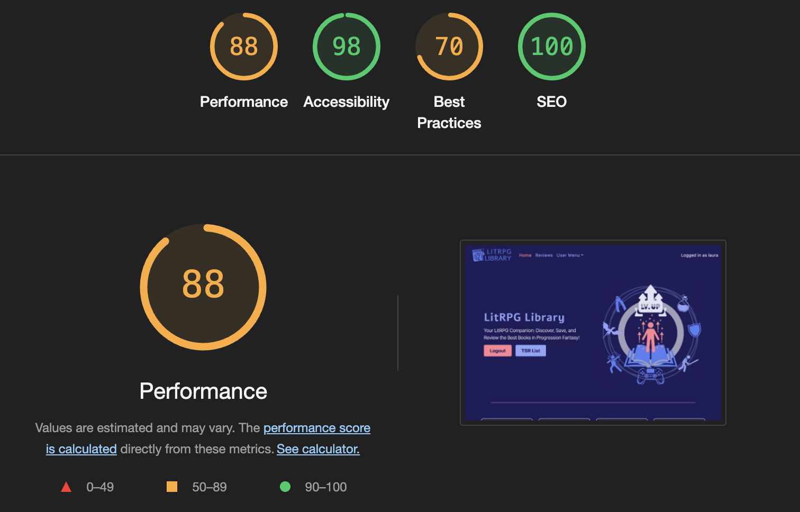

# Testing

This is the TESTING file for the [LitRPG Library](https://litrpg-library-2e24401b712e.herokuapp.com/) website.

Return back to the [README.md](README.md) file.

## Testing Contents  
  
- [Testing](#testing)
  - [Testing Contents](#testing-contents)
  - [Validation](#validation)
    - [HTML Validation](#html-validation)
    - [JavaScript Validation](#javascript-validation)
    - [Python Validation](#python-validation)
    - [CSS Validation](#css-validation)
    - [Lighthouse Scores](#lighthouse-scores)
    - [Wave Accessibility Evaluation](#wave-accessibility-evaluation)
  - [Manual Testing](#manual-testing)
    - [User Input/Form Validation](#user-inputform-validation)
    - [Browser Compatibility](#browser-compatibility)
    - [Testing User Stories](#testing-user-stories)
    - [Dev Tools/Real World Device Testing](#dev-toolsreal-world-device-testing)
  - [Bugs](#bugs)
    - [Known Bugs](#known-bugs)

## Validation

### HTML Validation
Three pages had errors, as shown below. All errors were related to summer note or django forms.

    
Register - Errors
  
      

 

    
Add Review - Errors
  
      

 

    
Review Edit - Errors
  
      

 

| HTML Source Code/Page | Errors | Warnings |
| ---- | ------ | -------- | 
| Index | 0 | 0 |
| Sign In | 0 | 0 |
| Register | 4 | 0 |
| SI w/ Google | 0 | 0 |
| Log out| 0 | 0 |
| Add Book | 0 | 0 |
| Add Review | 9 | 0 |
| Review Detail | 0 | 0 |
| Review List | 0 | 0 |
| Review Edit | 9 | 0 |
| tbr_list | 0 | 0 |
| TOS | 0 | 0 |
| PP| 0  | 0 |
  

  

### JavaScript Validation

[JSHint](https://jshint.com/) was used to validate the JavaScript code added to the project. External JS, for Bootstrap purposes, obtained via [CDN](https://cdnjs.cloudflare.com/ajax/libs/bootstrap/5.2.3/js/bootstrap.min.js) was not validated through JSHint.

| JS File | Screenshot | Errors | Warnings |
| ---- | ---------- | ------ | -------- |
| cover_preview.js |  | none | none |
| edit_delete.js|  | none | none |
| likes.js|  | none | none |
| pause.js|  | none | none |
| summernote.js|  | none | none |

### Python Validation

[CI Python Linter](https://pep8ci.herokuapp.com/#) was used to validate the Python files that were created or edited by me. There were no issues, screenshots can be seen below.

| Feature | admin.py | forms.py | models.py | urls.py | views.py |
|---------|----------|----------|-----------|---------|----------|
| To Be Read | [no errors](documentation/testing/py/review_admin.png) | [no errors](documentation/testing/py/review_forms.png) | [no errors](documentation/testing/py/review_models.png) | [no errors](documentation/testing/py/review_urls.png) | [no errors](documentation/testing/py/review_views.png) |
| To Be Read | [no errors](documentation/testing/py/tbr_admin.png) | N/A | [no errors](documentation/testing/py/tbr_models.png) | [no errors](documentation/testing/py/tbr_urls.png) | [no errors](documentation/testing/py/tbr_views.png) |
| config | settings.py: [no errors](documentation/testing/py/config_settings.png) | N/A | N/A | [no errors](documentation/testing/py/config_urls.png) | N/A |

### CSS Validation 

[W3C CSS Validator](https://jigsaw.w3.org/css-validator/) was used to validate my CSS file. External CSS was not tested. No issues.

  

 
   
### Lighthouse Scores
Testing was carried out in Lighthouse with the overall scores being fairly reasonable on desktop and quite a bit lower on mobile. I will consider image size and other possible ways to handle user uploaded images to limit size and format in the next version of LitRPG Library.

**Desktop**  

  
*Desktop Home Page*  
  
  
*Desktop Article Page*
  
**Mobile**  

 
*Mobile Home Page*  
  
 
*Mobile Article Page*
  

  

### Wave Accessibility Evaluation

  
  
I used the Wave tool to ensure accessiblity. There were a couple of contrast errors but I couldn't find the little icon on the page to show me where they were. I suspect it may be the page links in my footer. When active/hovered over they go fairly dark. The alerts related to the fact I'm switching out the hero image on click and it didn't like that the names were similar. Additionally, it pointed out a redundent link in the navigation (my logo and the 'home' tab). I disagree and think they should both be linked. It also reports that I skipped a heading level. 
  

  

## Manual Testing

### User Input/Form Validation

Testing was carried out on a desktop using the Chrome and Edge browsers to ensure all forms take the intended input and process the input appropriately.

| Feature                        | Tested? | User Input Required                | User Feedback Provided                                                                                          | Pass/Fail | Fix |
|--------------------------------|---------|------------------------------------|----------------------------------------------------------------------------------------------------------------|-----------|-----|
| **Navbar Logo and Links**      | Yes     | Click                             | Links navigate to correct pages. Tooltips provide context in desktop/mobile views.                             | Pass      | -   |
| **Home Page Text Links**       | Yes     | Click                             | Text links (e.g., 'Home', 'Register', 'Reviews') work as expected.       | Pass      | -   |
| **Hero Image Pauses**       | Yes     | Click                             | Image switches from gif to png on      | Pass    |      -     |                                     | Pass      | -   |
| **Sign In Page**               | Yes     | Username/Email/Password           | Inputs must match registration exactly; errors prompt user for corrections.                                    | Pass      | -   |
| **Google Sign In**             | Yes     | Click                             | Redirects to Google OAuth login; user is returned to the website as logged in.                                 | Pass      | -   |
| **Sign Out Button**            | Yes     | Click                             | User is logged out and sees a confirmation message.                                                            | Pass      | -   |
| **Add Review**                 | Yes     | Title/Content/Text Fields         | Prompts for missing required fields, review is saved and displayed.                                            | Pass      | -   |
| **Edit Review**                | Yes     | Title/Content/Text Fields         | Displays saved changes; prompts for missing required fields if left empty.                                     | Pass      | -   |
| **Delete Review**              | Yes     | Click                             | Confirms deletion with a modal. Deletes review or cancels and returns to the page.                             | Pass      | -   |
| **Add Comment**                | Yes     | Text Input                        | User receives confirmation of submission, awaiting moderation (if applicable).                                 | Pass      | -   |
| **Edit Comment**               | Yes     | Text Input                        | Changes to comments are saved and updated in real-time.                                                        | Pass      | -   |
| **Delete Comment**             | Yes     | Click                             | Modal confirms deletion; comment is deleted or action is canceled.                                             | Pass      | -   |
| **Like/Unlike Comments**       | Yes     | Click                             | Like count updates instantly.                                                                                  | Pass | - |
| **Like/Unlike Reviews**       | Yes     | Click                             | Like count updates instantly.                                                                                  | Pass | - |

### Browser Compatibility

LitRPG was tested on the following browsers, new users were created, registered users data edited and all features were tested:

- Chrome Version 131.0.6778.109 
- 131.0.2903.86
- Version 18.1.1 

<!-- | Browser | Issue | Functionality |
|---------|-------|---------------|
| FireFox | Profile Edit/Upload Image - File input 'Browse' Button centered in input field | Button works as expected |
| FireFox | Profile Dashboard - scrollbars following Mozilla styling | No issue |
| Safari  | Scrollbars following Safari styling | No issue | -->

### Testing User Stories

<!-- User Stories are documented in the FreeFido [GitHub Projects Board](https://github.com/users/amylour/projects/4). User Stories are numbered, with Acceptance Criteria and Tasks detailed within. Testing was carried out on Dev Tools for desktop/tablet/mobile, by creating multiple accounts for test users: FidoTest1, FidoTest2, FidoTest3 etc and following through by ensuring that the Acceptance Criteria were met. All features were tested to ensure that they provided the user with the expected output and action.

| User Story                 | Acceptance Criteria Met?  | Tested | Response     | Pass/Fail | Fix     |
|----------------------------|---------------------------|--------|--------------|-----------|---------|
| #1 - Home/About Template   | Yes                       | Yes    | No issues    | Pass      |    -    |
| #2 - Navigation            | Yes                       | Yes    | No issues    | Pass      |    -    |
| #3 - Footer                | Yes                       | Yes    | No issues    | Pass      |    -    |
| #4 - Login Page            | Yes                       | Yes    | No issues    | Pass      |    -    |
| #5 - SignUp/Register Page  | Yes                       | Yes    | No issues    | Pass      |    -    |
| #6 - Profile SetUp         | Yes                       | Yes    | No issues    | Pass      |    -    |
| #7 - Make a Booking Page   | Yes                       | Yes    | No issues    | Pass      |    -    |
| #8 - Create a Booking Page | Yes                       | Yes    | No issues    | Pass      |    -    |
| #9 - Visit Us Page         | Yes                       | Yes    | No issues    | Pass      |    -    |
| #10 - Logout Page          | Yes                       | Yes    | No issues    | Pass      |    -    |
| #11 - Booking Confirmation Email | Feature not included in this version - 'Should Have' item | | | | |
| #12 - Edit User Profile    | Yes                       | Yes    | No issues    | Pass      |    -    |
| #13 - Delete User Profile  | Feature left in backlog as currently unnecessary, User can delete individual items and Admin can delete complete account, future version will include delete account | | | | |
| #14 - Edit Booking         | Yes                       | Yes    | No issues    | Pass      |    -    |
| #15 - Delete Booking       | Yes                       | Yes    | No issues    | Pass      |    -    |
| #16 - Error Pages          | Yes                       | Yes    | No issues    | Pass      |    -    |
| #17 - Articles             | Yes                       | Yes    | No issues    | Pass      |    -    |
| #18 - Site Pagination      | Yes                       | Yes    | No issues    | Pass      |    -    |
| #19 - View Likes           | Yes                       | Yes    | No issues    | Pass      |    -    |
| #20 - View Articles        | Yes                       | Yes    | No issues    | Pass      |    -    |
| #21 - Open Article         | Yes                       | Yes    | No issues    | Pass      |    -    |
| #22 - Like/Unlike Article  | Yes                       | Yes    | No issues    | Pass      |    -    |
| #23 - Comment on a Post    | Yes                       | Yes    | No issues    | Pass      |    -    |
| #24 - Gallery Page         | Yes                       | Yes    | No issues    | Pass      |    -    |
| #24(mistake-allocated #24 twice) | Alert Messages | Yes   | No issues    | Pass      |    -    |
| #25 - Create Article       | Yes                       | Yes    | No issues    | Pass      |    -    |
| #26 - Delete Article       | Yes                       | Yes    | No issues    | Pass      |    -    |
| #27 - Edit Article         | Yes                       | Yes    | No issues    | Pass      |    -    |
| #28 - Search Function      | Yes                       | Yes    | No issues    | Pass      |    -    |
| #29 - Delete Comment       | Yes                       | Yes    | No issues    | Pass      |    -    |
| #30 - User Feedback for max Booking Allowance | Yes                       | Yes    | No issues    | Pass      |    -    |
| #31 - Upload Image to Gallery Wall | Yes                       | Yes    | No issues    | Pass      |    -    |
| #32 - Add Review           | Feature not included in this version - 'Could Have' item | | | | |
| #33 - Edit Review          | Feature not included in this version - 'Could Have' item | | | | |
| #34 - Delete Review        | Feature not included in this version - 'Could Have' item | | | | |
| #35 - Delete Photo         | Yes                       | Yes    | No issues    | Pass      |    -    | -->

  
### Dev Tools/Real World Device Testing

<!-- Responsiveness testing was carried out using Google Dev Tools on the devices detailed within the below table. Responsiveness was evident on all features throughout all tested devices. Occassionally I would have to refresh the page by clicking the 'FreeFido' logo as the page would load zoomed in or out on the simualted device. When refreshed and CSS checked the desired outcome was observed. I put this down to a caching issue in Chrome as this issue was not observed when testing on the available real world devices. -->
  

**Dev Tools Device Testing - all features tested, issues noted below**
Tested with responsive dimensions and no issues.
   
  
**Real World Device Testing**
| Device      | Feature    | Issue  | Fix  | 
| ------------| ---------- | ------ |------|
| iPhone 15| All features |  No issues  | None needed |
| iPhone 13 mini  | All features | No issues | None needed |
| iPad Air 2022 |    All features      |    No issues    |  None needed |
| MacBook Air M3 2024| All features | No issues | None needed |

## Bugs  
  
As a newcomer to Django and database development, I faced numerous challenges typical of first-time projects. The following bugs were particularly complex, requiring extensive troubleshooting and occasional guidance from support resources.

| No. | Bug | Solved | Fix | Solution Credit | Commit no. |
| --- | ---------------- | ---- | ------------- | -------------- | ------------|
| 1   | Unable to deploy to Heroku | Yes | Procfile set up incorrect - missing "web:" and removed a trailing backslash from a url in allowed hosts | Me! I Found it! Win! | a9f523b and e9057d4 |
| 2   | CSS not showing in development or deployed site | Yes | Debug was set to False for deployment - swaped back to True and everything worked. | A wild Amy appeared in Coding Coach| none |
| 3  | Migrations not migrating | Yes | In the book model I changed "book" to "book_title" | Me! I fixed it! Another Win!| 6c98937 |
| 4 | When editing a comment, form forces you to select a rating again. This appears in the comment as a double rating | Yes | the javascript was fetching all of the innter conent of the element with the ID of comment{{ comment.id }} and I needed to move the review content outside of this div | The Wonderful Coding Wizard Ruu at Coding Coach| e3a0f90 |

### Known Bugs

