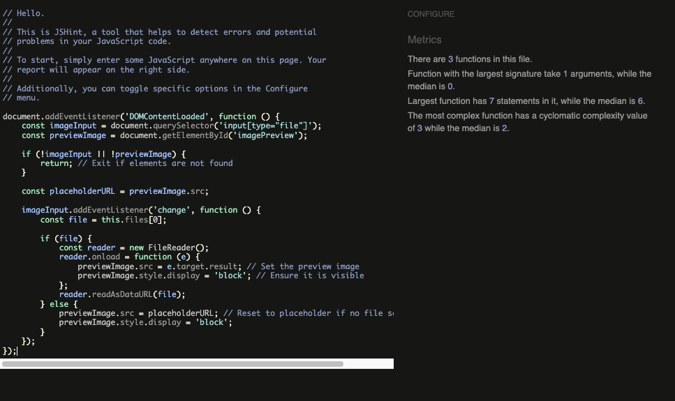

# Testing

This is the TESTING file for the [LitRPG Library](https://litrpg-library-2e24401b712e.herokuapp.com/) website.

Return back to the [README.md](README.md) file.

## Testing Contents  
  
- [Testing](#testing)
  - [Testing Contents](#testing-contents)
  - [Validation](#validation)
    - [HTML Validation](#html-validation)
    - [JavaScript Validation](#javascript-validation)
    - [Python Validation](#python-validation)
    - [CSS Validation](#css-validation)
    - [Lighthouse Scores](#lighthouse-scores)
    - [Wave Accessibility Evaluation](#wave-accessibility-evaluation)
  - [Manual Testing](#manual-testing)
    - [User Input/Form Validation](#user-inputform-validation)
    - [Browser Compatibility](#browser-compatibility)
    - [Testing User Stories](#testing-user-stories)
    - [Dev Tools/Real World Device Testing](#dev-toolsreal-world-device-testing)
  - [Bugs](#bugs)
    - [Known Bugs](#known-bugs)

## Validation

### HTML Validation
Three pages had errors, as shown below. All errors were related to summer note or django forms.

    
Register - Errors
  
      

 

    
Add Review - Errors
  
      

 

    
Review Edit - Errors
  
      

 

| HTML Source Code/Page | Errors | Warnings |
| ---- | ------ | -------- | 
| Index | 0 | 0 |
| Sign In | 0 | 0 |
| Register | 4 | 0 |
| SI w/ Google | 0 | 0 |
| Log out| 0 | 0 |
| Add Book | 0 | 0 |
| Add Review | 9 | 0 |
| Review Detail | 0 | 0 |
| Review List | 0 | 0 |
| Review Edit | 9 | 0 |
| tbr_list | 0 | 0 |
| TOS | 0 | 0 |
| PP| 0  | 0 |
  

  

### JavaScript Validation

[JSHint](https://jshint.com/) was used to validate the JavaScript code added to the project. External JS, for Bootstrap purposes, obtained via [CDN](https://cdnjs.cloudflare.com/ajax/libs/bootstrap/5.2.3/js/bootstrap.min.js) was not validated through JSHint.

| JS File | Screenshot | Errors | Warnings |
| ---- | ---------- | ------ | -------- |
| cover_preview.js |  | none | none |
| edit_delete.js|  | none | none |
| likes.js|  | none | none |
| pause.js|  | none | none |
| summernote.js|  | none | none |

### Python Validation

[CI Python Linter](https://pep8ci.herokuapp.com/#) was used to validate the Python files that were created or edited by me. There were no issues, screenshots can be seen below.

| Feature | admin.py | forms.py | models.py | urls.py | views.py |
|---------|----------|----------|-----------|---------|----------|
| To Be Read | [no errors](documentation/testing/py/review_admin.png) | [no errors](documentation/testing/py/review_forms.png) | [no errors](documentation/testing/py/review_models.png) | [no errors](documentation/testing/py/review_urls.png) | [no errors](documentation/testing/py/review_views.png) |
| To Be Read | [no errors](documentation/testing/py/tbr_admin.png) | N/A | [no errors](documentation/testing/py/tbr_models.png) | [no errors](documentation/testing/py/tbr_urls.png) | [no errors](documentation/testing/py/tbr_views.png) |
| config | settings.py: [no errors](documentation/testing/py/config_settings.png) | N/A | N/A | [no errors](documentation/testing/py/config_urls.png) | N/A |

### CSS Validation 

[W3C CSS Validator](https://jigsaw.w3.org/css-validator/) was used to validate my CSS file. External CSS was not tested. No issues.

  

 
   
### Lighthouse Scores
Testing was carried out in Lighthouse with the overall scores being fairly reasonable on desktop and quite a bit lower on mobile. I will consider image size and other possible ways to handle user uploaded images to limit size and format in the next version of LitRPG Library.

**Desktop**  

  
*Desktop Home Page*  
  
  
*Desktop Article Page*
  
**Mobile**  

 
*Mobile Home Page*  
  
 
*Mobile Article Page*
  

  

### Wave Accessibility Evaluation

  
  
I used the Wave tool to ensure accessiblity. There were a couple of contrast errors but I couldn't find the little icon on the page to show me where they were. I suspect it may be the page links in my footer. When active/hovered over they go fairly dark. The alerts related to the fact I'm switching out the hero image on click and it didn't like that the names were similar. Additionally, it pointed out a redundent link in the navigation (my logo and the 'home' tab). I disagree and think they should both be linked. It also reports that I skipped a heading level. 
  

  

## Manual Testing

### User Input/Form Validation

Testing was carried out on a desktop using the Chrome and Edge browsers to ensure all forms take the intended input and process the input appropriately.

| Feature                        | Tested? | User Input Required                | User Feedback Provided                                                                                          | Pass/Fail | Fix |
|--------------------------------|---------|------------------------------------|----------------------------------------------------------------------------------------------------------------|-----------|-----|
| **Navbar Logo and Links**      | Yes     | Click                             | Links navigate to correct pages. Tooltips provide context in desktop/mobile views.                             | Pass      | -   |
| **Home Page Text Links**       | Yes     | Click                             | Text links (e.g., 'Home', 'Register', 'Reviews') work as expected.       | Pass      | -   |
| **Hero Image Pauses**       | Yes     | Click                             | Image switches from gif to png on      | Pass    |      -     |                                     | Pass      | -   |
| **Sign In Page**               | Yes     | Username/Email/Password           | Inputs must match registration exactly; errors prompt user for corrections.                                    | Pass      | -   |
| **Google Sign In**             | Yes     | Click                             | Redirects to Google OAuth login; user is returned to the website as logged in.                                 | Pass      | -   |
| **Sign Out Button**            | Yes     | Click                             | User is logged out and sees a confirmation message.                                                            | Pass      | -   |
| **Add Review**                 | Yes     | Title/Content/Text Fields         | Prompts for missing required fields, review is saved and displayed.                                            | Pass      | -   |
| **Edit Review**                | Yes     | Title/Content/Text Fields         | Displays saved changes; prompts for missing required fields if left empty.                                     | Pass      | -   |
| **Delete Review**              | Yes     | Click                             | Confirms deletion with a modal. Deletes review or cancels and returns to the page.                             | Pass      | -   |
| **Add Comment**                | Yes     | Text Input                        | User receives confirmation of submission, awaiting moderation (if applicable).                                 | Pass      | -   |
| **Edit Comment**               | Yes     | Text Input                        | Changes to comments are saved and updated in real-time.                                                        | Pass      | -   |
| **Delete Comment**             | Yes     | Click                             | Modal confirms deletion; comment is deleted or action is canceled.                                             | Pass      | -   |
| **Like/Unlike Comments**       | Yes     | Click                             | Like count updates instantly.                                                                                  | Pass | - |
| **Like/Unlike Reviews**       | Yes     | Click                             | Like count updates instantly.                                                                                  | Pass | - |

### Browser Compatibility

LitRPG was tested on the following browsers, new users were created, registered users data edited and all features were tested:

- Chrome Version 131.0.6778.109 
- Edge 131.0.2903.86
- Safari Version 18.1.1 

### Testing User Stories

 User Stories are documented in the LitRPG Library [GitHub Projects Board](https://github.com/users/laurachri-hall/projects/6). User stories are sequentially numbered, with acceptance criteria outlined for all and tasks detailed for most. Testing was conducted using Dev Tools across desktop, tablet, and mobile devices. Each feature was thoroughly tested to verify that it delivered the expected functionality and behavior for users throughout the project.
### User Story Testing

| User Story                                      | Acceptance Criteria Met? | Tested | Response                              | Pass/Fail | Fix       |
|------------------------------------------------|--------------------------|--------|---------------------------------------|-----------|-----------|
| #1 - View paginated lists of posts             | Yes                      | Yes    | Pagination works correctly and displays the appropriate pages | Pass | -         |
| #2 - Posting a Review                          | Yes                      | Yes    | Reviews can be posted and displayed   | Pass      | -         |
| #3 - Editing a Review                          | Yes                      | Yes    | Changes to reviews are saved and displayed | Pass | -         |
| #4 - Deleting a Review                         | Yes                      | Yes    | Reviews are removed from the system   | Pass      | -         |
| #5 - Liking a Review                           | Yes                      | Yes    | Reviews can be liked/unliked          | Pass      | -         |
| #6 - Posting a Comment                         | Yes                      | Yes    | Comments can be added successfully    | Pass      | -         |
| #7 - Editing a Comment                         | Yes                      | Yes    | Comments can be edited successfully   | Pass      | -         |
| #8 - Deleting a Comment                        | Yes                      | Yes    | Comments are deleted successfully     | Pass      | -         |
| #9 - Liking a Comment                          | Yes                      | Yes    | Comments can be liked/unliked         | Pass      | -         |
| #10 - Adding a book to the TBR pile (wishlist) | Yes                      | Yes    | Book added to TBR list successfully   | Pass      | -         |
| #11 - Removing a book from the TBR pile        | Yes                      | Yes    | Book is removed from the TBR list     | Pass      | -         |
| #12 - Move a book to the Read List             | Feature not included in this version - "could have" item | No | - | - | - |
| #13 - Accessing User Profile                   | Feature not included in this version - "could have" item | No | - | - | - |
| #14 - Managing Reviews                         | Feature not included in this version - "could have" item | No | - | - | - |
| #15 - Managing Comments                        | Feature not included in this version - "could have" item | No | - | - | - |
| #16 - Login with Google                        | Yes                      | Yes    | Users can log in using Google credentials | Pass | -         |
| #17 - Opening a Post                           | Yes                      | Yes    | Users can open posts successfully     | Pass      | -         |

  
### Dev Tools/Real World Device Testing

I conducted responsiveness testing using Google Dev Tools on the devices listed in the table below, and all features were responsive across all tested devices. However, I faced a few challenges. When Debug was set to False, the site didn’t update as expected, and I noticed inconsistencies between resizing the browser window directly and using DevTools, which led to trust issues and more testing on real devices. Even with Debug set to True, refreshing didn’t always work, so I sometimes had to run collectstatic and clear the cache to see updates. 
  

**Dev Tools Device Testing - all features tested, issues noted below**
Tested with responsive dimensions and no issues.
   
  
**Real World Device Testing**
| Device      | Feature    | Issue  | Fix  | 
| ------------| ---------- | ------ |------|
| iPhone 15| All features |  No issues  | None needed |
| iPhone 13 mini  | All features | No issues | None needed |
| iPad Air 2022 |    All features      |    No issues    |  None needed |
| MacBook Air M3 2024| All features | No issues | None needed |

## Bugs  
  
As a newcomer to Django and database development, I faced numerous challenges typical of first-time projects. The following bugs were particularly complex, requiring extensive troubleshooting and occasional guidance from support resources.

| No. | Bug Description                                        | Solved | Fix/Action Taken                                                          | Solution Credit | Commit No. |
|-----|-------------------------------------------------------|--------|---------------------------------------------------------------------------|-----------------|------------|
| 1   | Unable to deploy to Heroku                            | Yes    | Procfile set up incorrectly, removed trailing backslash                   | Me              | a9f523b, e9057d4 |
| 2   | CSS not loading in development or deployment          | Yes    | Debug mode incorrectly set                                                | Amy (Coding Coach)             | N/A        |
| 3   | Migration issues after modifying models               | Yes    | Corrected field name in Book model                                        | Me, Perplexity AI              | 6c98937    |
| 4   | Double rating issue in comments on edit               | Yes    | Adjusted JavaScript and div placement                                     | Roo (Coding Coach) | e3a0f90 |
| 5   | TBR button in hero not redirecting correctly          | Yes    | Fixed the URL link for TBR button in the hero section                     | Me, Perplexity AI             | c526d47    |
| 6   | Comment editing not saving                            | Yes    | Added trailing slash to comment.js for correct submission handling        | Me, Perplexity AI              | e731098    |
| 7   | Overflow issue in add/edit forms for reviews          | Yes    | Adjusted form layout and styling                                          | Roo (Coding Coach)             | 6823495    |
| 8   | Review links insufficient contrast                    | Yes    | Improved contrast in review links for accessibility                      | Me              | a8ac5ee    |
| 9   | Pause script for hero image missing                   | Yes    | Re-added pause script to index.html                                       | Me              | 770b35     |
| 10  | Navbar covering content on small screens              | Yes    | Adjusted navbar styling and position for better responsiveness            | Me, ChatGBT              | 51848f8, f9d9b58 |
| 11  | Duplicate delete and edit buttons on review page      | Yes    | Removed duplicate buttons                                                 | Me              | a6d895e    |
| 12  | Like button not displaying or functioning             | Yes    | Debugged and fixed JavaScript for like functionality                      | Me, Chat GPT              | 2d370f7    |
| 13  | Hero image size changes unpredictably                 | Yes    | Fixed CSS for consistent hero image size                                  | Me, ChatGPT              | d6384c2    |
| 14  | Error in Google verification                          | Yes    | Corrected Google verification file and moved to appropriate path          | Me. Chat GPT              | 77f1e54    |
| 15  | HTML validation issues with SVG files                 | Yes    | Added trailing slashes to SVG tags                                        | Me, Chat GPT              | 9818675    |
| 16  | Google Sign-In integration not functioning            | Yes    | Adjusted TOS/PP and implemented required verification methods             | Me, Chat GBT              | 63bb55b    |
| 17  | Buttons misaligned on mobile view                     | Yes    | Adjusted CSS for mobile-friendly layout                                   | Me              | 330e2b     |
| 18  | Index page missing important layout sections          | Yes    | Restored accidentally deleted call-to-action and review sections          | Me              | 6ad562c    |
| 19  | Overlapping Delete/Confirm modals                     | Yes    | Removed duplicate modal instances                                         | John (Coding Coach)             | a6d895e    |
| 20  | Comment approvals default to "approved"              | Yes    | Changed comment model back to requiring manual admin approval             | Me              | d0471fa    |
| 21  | Error handling not providing clear feedback to users  | Yes    | Implemented clearer error messages     | Me, ChatGPT              | f2dca74    |

### Known Bugs

None of which I know. Please let me know if any are found and I'll do my best to fix them. 

